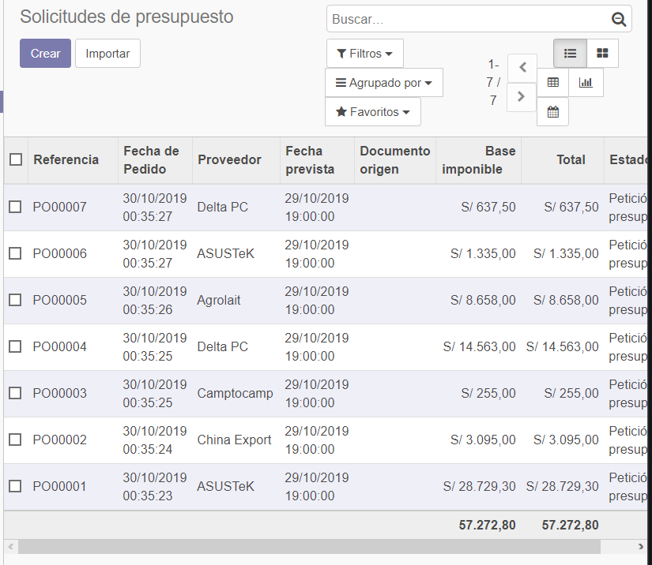
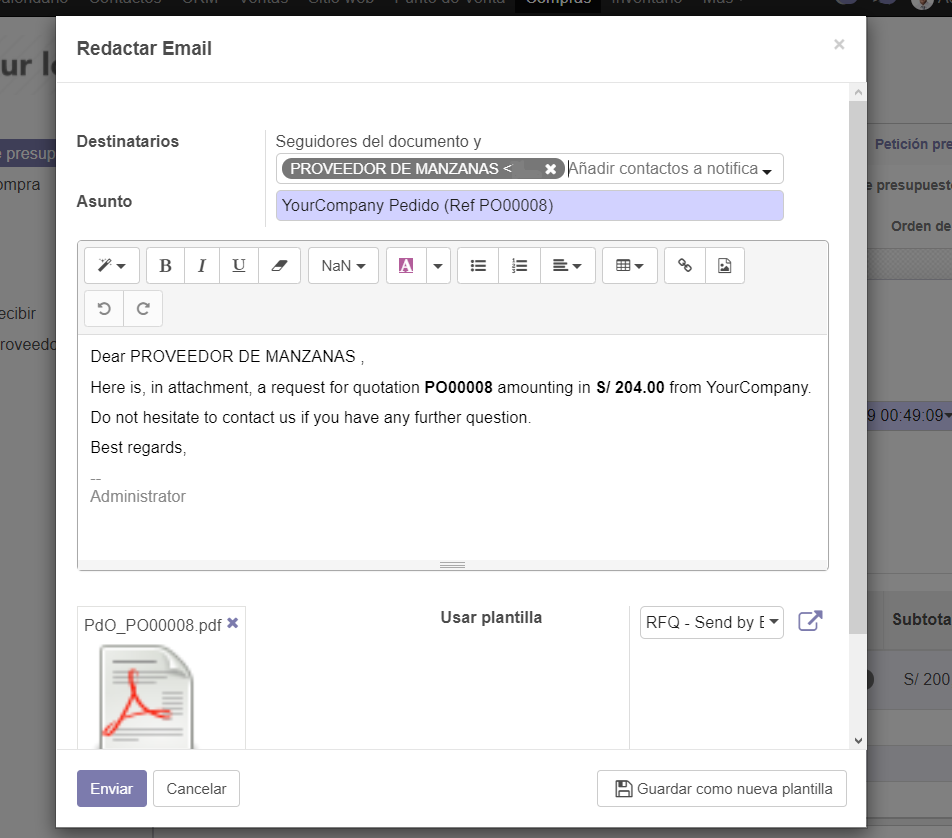
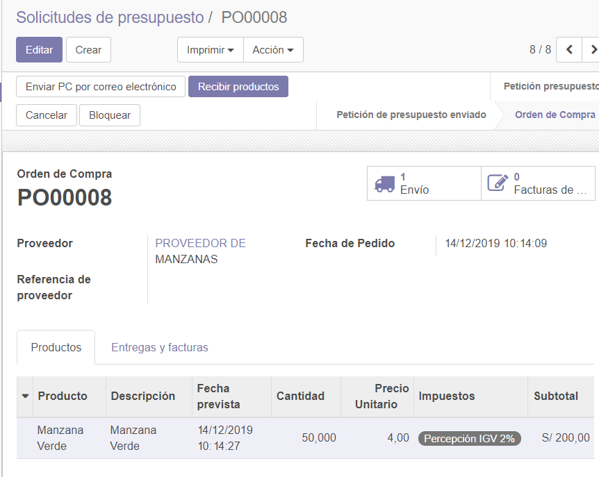
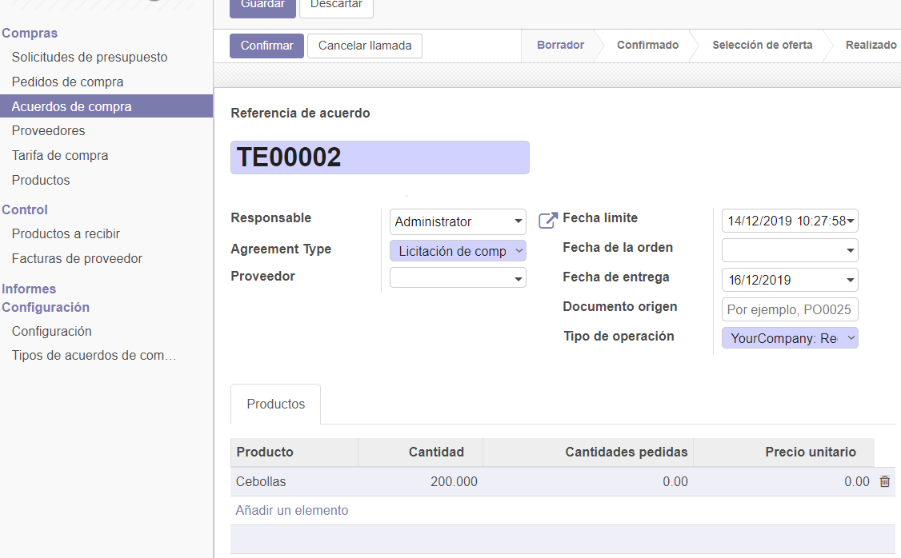
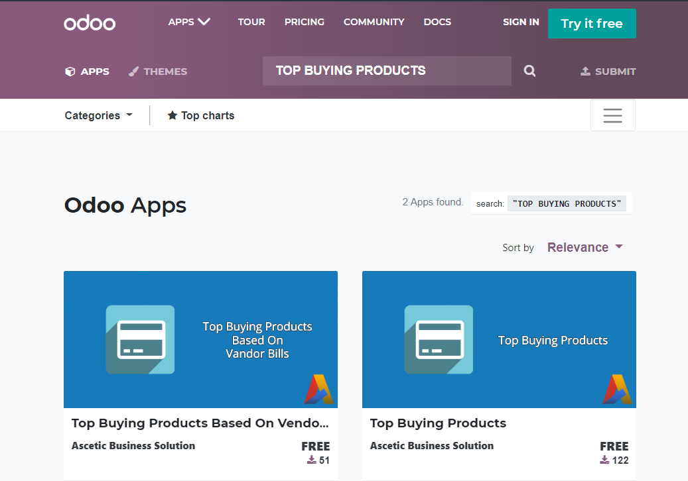

Instalamos el modulo de compras.

Tenemos las solicitudes de presupuesto.

Creamos una nueva solicitud con un nuevo proveedor y cuanto vamos a pedir.

configuramos el idioma.

Podemos enviar un email.

Podemos ver las solicitudes de presupuesto. 

La Guardamos y vemos que sale 1 envio y los datos llenados previamente

Vamos a hacer la simulacion de que trajeron ya el producto.

Vamos a ver como sale 2 envios de 25 para entregar los 50

Creamos una factura en borrador, para ver como seria.

Aqui vemos la factura al proovedor  de manzanas.

Tenemios el proveedor de manzanas con respectivas facturas y compras.

Le agregamos una cuenta para poder facturar el pago.

Ahora podemos ver una cuenta bancaria.

Realizamos el pago del proveedor.

Vemos que no se debe nada.

La manzana verde ahora tiene un proveedor.

Configuramos las compras y activamos la tarifa de compra.

Vemos que sale un nuevo campo en las compras.

Configuramos y activamos acuerdos de compra y nos sale una nueva opcion.

Ahora creamos un nuevo acuerdo de compra con un producto.

Creamos 2 solicitudes de presupuesto con esta licitacion.

Escogemos entre ambas la mejor opcion.

Vamos al link que nos dejaron y escogemos la primera opcion.

Descargamos el modulo Top Buying Products Based On...

## CONCLUSIONES

- Instalamos el modulo de compras para poder realizar el laboratorio.
- Creamos un nuevo proveedor a la manzana verde. 
- aumentamos el stock de manzanas para realizar un pedido y pagar
- Creamos nuestra cuenta bancaria.
- Vimps mas opciones al realizar compras.
- El laboratorio no estaba muy entendible.