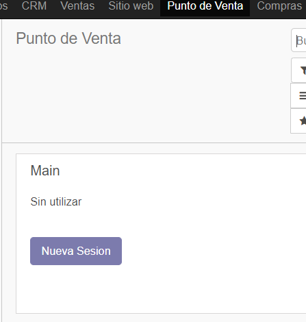
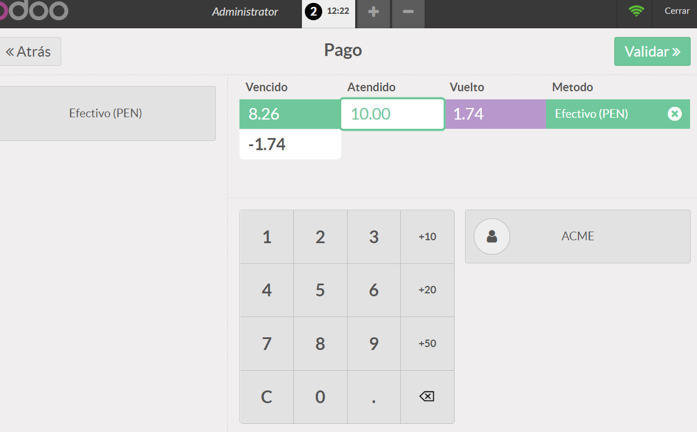
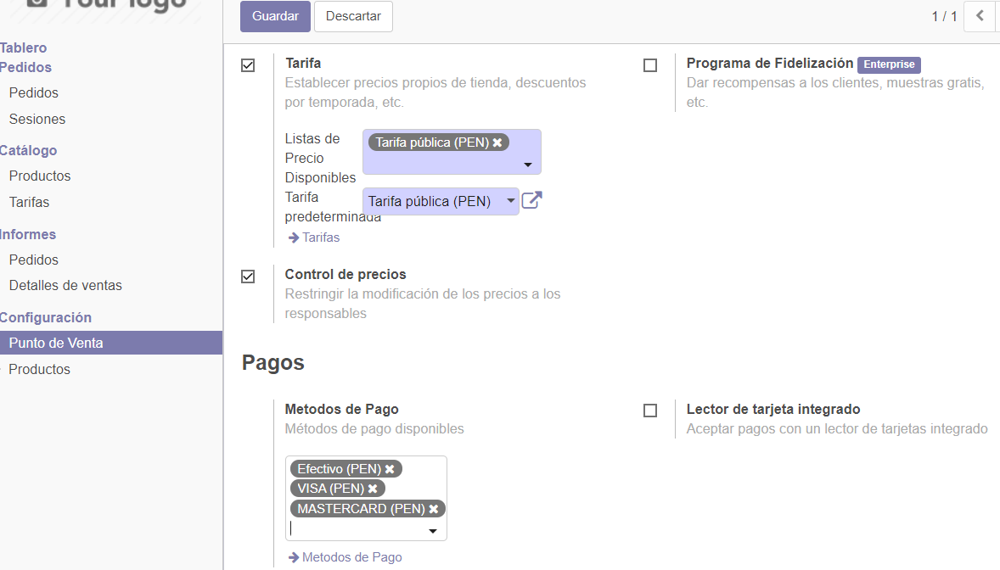

Tenemos que tener instalado el punto de venta.

Vemos el menu para poder iniciar nueva sesion.

Vemos diferentes productos, los cuales podemos llevar y seran sumados.

Si damos clic a pagar , vemos las suma total a pagar.

Nos pide la paga para continuar  y vemos cuanto de vuelto tenemos que dar y a traves de que plataforma pagaremos. que seria efectivo.

podemos ver una boleta con la manzana verde y unos precios.

Vamos a las sesiones y vemos que esta la sesion que hicimos.

Si entramos a una sesion vemos lo que esta sucediendo hasta ese momento.

Vamos a la configuracion de punto de venta y activamos las configuraciones.

Agregamos metodod de pago.

Modificamos las configuraciones.

Al crear la sesion nos manda a una pantalla donde estableceremos el balance de apertura

Ponemos productos para hacer una simulacion.

Ahora vemos los modos de pago y podmeos intercalarlos .

Regresamos a la zona donse venden y escogemos los productos.

Añadimos nuevas categorioas en la zona de productos, configuracion y categorias de PdV.

Agregamos contenido para cada categoria.

Vemos que nos sale de una forma como si fuera un restaurante que es lo configurado.

Al crearlas y seleccionarlas nos mandara como si fuera una orden de tal mesa en donde le podemos añadir productos y pedidos por esa mesa y su suma total.

Vemos su funcionamiento, y vemos que todo esta normalcomo antes.

Se puede agregar notas por mesa.

Tambien se puede hacer transferencias.

Este proceso puede ser realizado en todo.

Modificaremos el punto de venta cafeteria activando algunas opciones.

Hay nuevas opciones de boleta.

Tambien tenemos la separacion de cuenta.

## CONCLUSIONES

- Revisamos si teniamos instalado el punto de venta.
- Aprendimos a crear sesiones.
- Podemos acceder a diderentes productos y estos se suman solos.
- Ño realizado puede ser implementado en un restaurante, starbucks, pasteleria, para tener un mejor control.
- Vimos que podemos dar permisos a usuario los cuales no pueden modificar los precios a comparacion de un administrador.
- Vimos los diferentes tipos de boletas.
