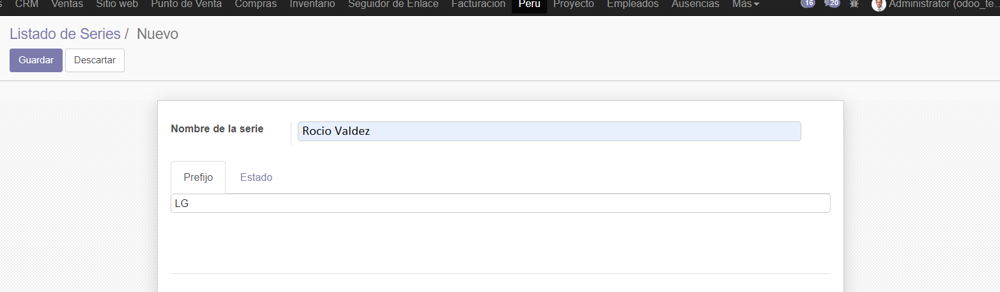

Creamos nuestra facturacion Peru , con su respectivo logo.

Vemos su liestado de series que tiene.

Podemos crear series como se puede ver.

Creamos uno para poder modificarlo.

Podemos ver que ya se lista , con sus respectivas caracteristicas.

Creamos mas series.

Se puede buscar las series por su prefijo.

Agregamos mas series por codigo ya escrito.

Creamos un archivo y le ejecutamos con node para instalar los paquetes pedidos.

Tenemos una api con todas las series que tenemos en la lista.

## CONCLUSIONES

- Creamos nuestra facturacion con Peru y un logo.
- Creamos series atraves de una interfaz y tambien un codigo de cmd.
- Configuramos el metodo de busquedo por prefijos.
- Usamos todo en modo desarrollador para poder modificar
- Modificamos la interfaz que nos daba la instalacion del modulo a   nuestra manera
- Estuvimos actualizando constantemente el modulo.
